# EvacuationModelling
# Etap 1. Analiza problemu i dziedziny
08.03.2023
## Problem
Zbadanie możliwości modelowania procesu ewakuacji budynku D17

**Proces ewakuacji** - proces, który pozwala osobom znajdującym się w zagrożonej przestrzeni dotrzeć do miejsca bezpieczeństwa, składającego się z procesu przed
przemieszczaniem się i procesu przemieszczania się (standard ISO/TR 13387-8)
### Cele
- [ ] opracowanie przygotowania rzeczywistych danych - zbiór danych, o którym mowa w rozdziale 5.2. pracy (strona 40), rozrysowane tabelki
- [ ] zbadanie gotowych rozwiązań, wybór modeli
- [ ] symulacje na modelach - zebranie danych
- [ ] porównanie wyników symulacji ze sobą nawzajem i z rzeczywistymi danymi - walidacja badanych modeli
### Jakich danych potrzebujemy
- [ ] plany budynków - mapowanie budynków do postaci BIM (Building Information Modelling),
  do ustalenia: stopień dokładności, dostępne są plany budynków i ewakuacji - na każdym piętrze są umieszczone schematy
- [ ] stan początkowy - rozmieszczenie osób w budynkach
- [ ] czas, jaki upłynął do momentu opuszczenia posczególnych pomieszczeń
- [ ] prędkość poruszających się osób: v = 0,91m/s (wg dostarczonej pracy)
### Przegląd gotowych rozwiązań
- [ ] [Cromosim](http://www.cromosim.fr/example_micro.html#social-force-model)
- [ ] [JuPedSim](https://www.jupedsim.org/jpscore_introduction.html)
- [ ] [jCrowdSimulator](https://github.com/FraunhoferIVI/jCrowdSimulator)
- [ ] [STEPS](https://www.steps.mottmac.com/free-trial) - brak odpowiedzi w kwestii wersji próbnej
- [ ] [Pathfinder](https://www.thunderheadeng.com/pathfinder) - spełnia wszystkie wymagania, można stworzyć plan budynku na podstawie zdjęcia, obsługuje schody, animacje 3d
- [ ] [AnyLogic](https://www.anylogic.com/) - w teorii spełnia wymagania i robi to co Pathfinder, ale trudny w obsłudze

## Dziedzina
### Metryki
- krzywa ewakuacyjna - zależność liczby osób pozostających w budynku od czasu,
- liczba ludzi, którzy wyszli poszczególnymi wyjsciami ewakuacyjnymi,
- sekwencje ewakuacji - analiza rozmieszczenia ludzi w danych momentach ewakuacji,
- identyfikacja punktów zatłoczenia
### Dyskusja
- reprezentacja pięter budynku `Teleportation cell`
- *proces przed przemieszczaniem się* - czynniki psychospołeczne, zazwyczaj doliczenie dodatkowego czasu
- różne modele dynamiki pieszych oferują różne opisy liczbowe do pomiaru ruchu pieszych (przepływ, zagęszczenie)
### Klasyfikacja modeli
#### mikroskopowe / makroskopowe
#### ciągłe / dyskretne
#### deterministyczne / stochastyczne
#### oparte o reguły / oparte o siły
#### wysokiej prawdziwości / niskiej prawdziwości

# Etap 2. Analiza wymagań i przegląd dostępnych rozwiązań pod ich kątem
22.03.2023
## Kryteria wyboru rozwiązania (lista wymagań):
- [ ] darmowy dostęp do oprogramowania i jego kodu źródłowego
- [ ] open source lub licencja studencka
- [ ] brak wygórowanych wymagań technicznych do uruchomienia symulacji
- [ ] łatwość instalacji i obsługi narzędzia
- [ ] obecność tutoriali i wsparcia
- [ ] popularność rozwiązania (np. wykorzystanie przez firmy zajmujące się problematyką)
- [ ] łatwość procesu dostosowania danych do formatu akceptowanego przez program
- [ ] prosta interpretacja wyników działania programu
- [ ] funkcjonalności
- [ ] bieżące update'y

## Przegląd symulatorów
| Symulator | [Pathfinder](https://www.thunderheadeng.com/pathfinder) | STEPS |
|--------:|----------------------------|--------------|
| dostęp | możliwość pobrania | możliwość pobrania |
| licencja | licencja studencka | licencja studencka (?) / free trial |
| wymagania techniczne | dostępne tutoriale i forum | tutoriale, forum |
| instalacja i obsługa | bez problemu | brak odpowiedzi |
| wsparcie | dokumentacja, tutoriale, forum | brak odpowiedzi |
| popularność | dobre opinie | dobre opinie |
| wyniki | automatyczna analiza wyników | mapy, wizualizacje, csv, xlsx |
| funckjonalności| windy, kolejki, customowa populacja | ruch pieszych |
| bieżące update'y | tak | ? |

## Ogólne informacje
- do każego sprawdzonego rozwiązania musimy dopasować dane wejściowe do przyjmowanego formatu
- "przyjemność obsługi"
- rozwiązania komercyjne: Pathfinder - dostaliśmy licencję studencką, STEPS - brak odpowiedzi
- spora część rozwiązań z listy jest niedostępna
- brak bieżących informacji dotyczących tematu

## Artykuły
- [A review on the hospital evacuation simulation models](https://www.sciencedirect.com/science/article/abs/pii/S2212420922003028), Intiaz Mohammad Abir, Azhar Mohd Ibrahim, Siti Fauziah Toha, Amir Akramin Shafie
- [A Review of Building Evacuation Models, 2nd Edition](https://www.nist.gov/publications/review-building-evacuation-models-2nd-edition), Erica Kuligowski

# Etap 3. Uruchomione narzędzia
19.04.2023
## Pathfinder
Pathfinder - komercyjny program opracowany przez Thunderhead Engineering. Umożliwia tworzenie trójwymiarowych modeli budynków oraz przeprowadzanie symulacji agentowych różnych scenariuszy ewakuacyjnych. Agenci są świadomi swojego otoczenia i dynamicznie podejmują najkorzystniejsze decyzje w celu ewakuowania się z budynku.

Obecnie wpełni zaimplementowane zostały pierwsze dwa piętra budynku D-17. Na każdym piętrze budynku zostało losowo umieszczonych między 50 a 70 agentów, a jedyne wyjście z budynku to główne drzwi na parterze. Na nagraniu widać model budynku, poruszające się postacie oraz przykłądowe funkcje programu Pathfinder, jak mierzenie odległości między osobami oraz wyświetlanie jak zatłoczony jest dany obszar modelu.
### [Nagranie z przeprowadzonej symulacji](https://drive.google.com/file/d/1_rXWrx716G6AnXzlbwOU6oQEncsTUIY8/view?usp=sharing)

### Zdjęcia z programu
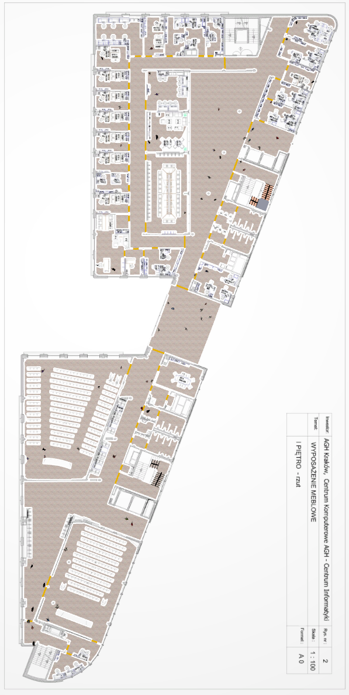
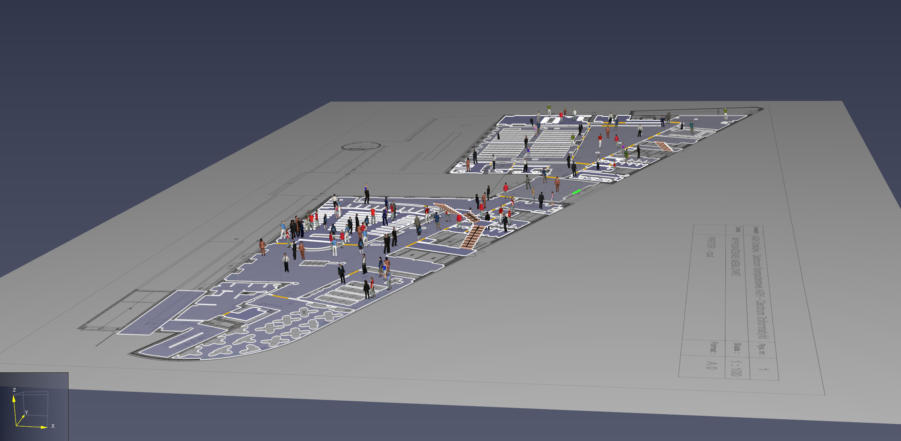
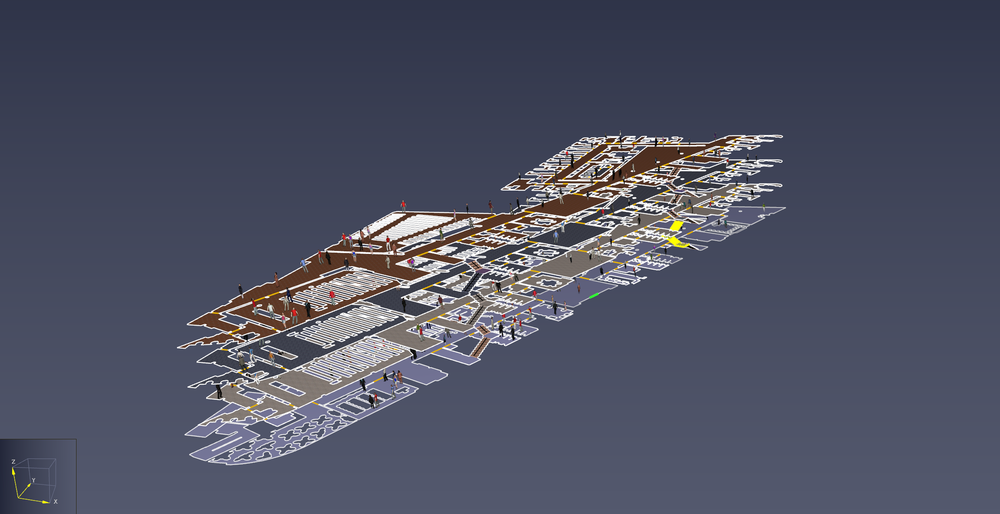
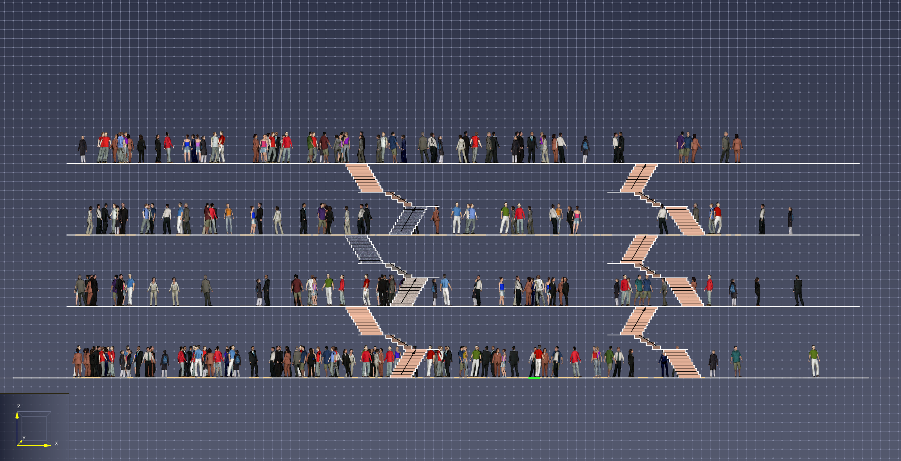
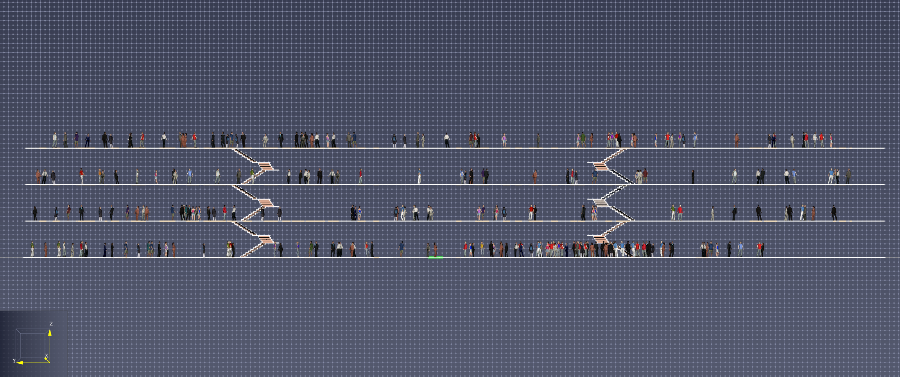

### Wykresy
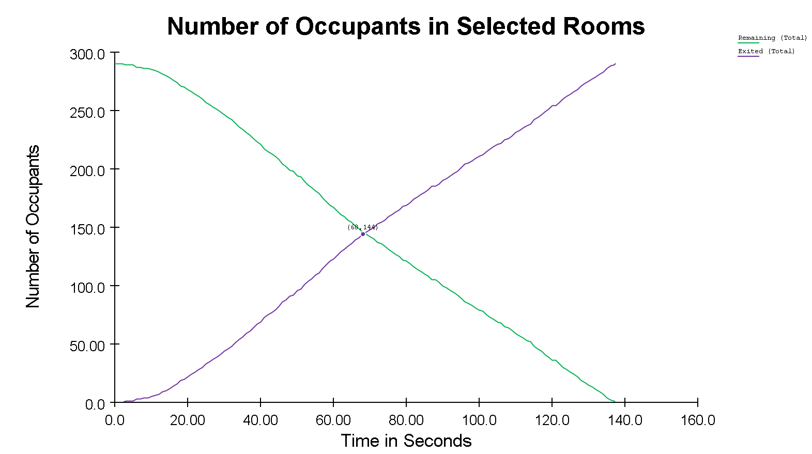
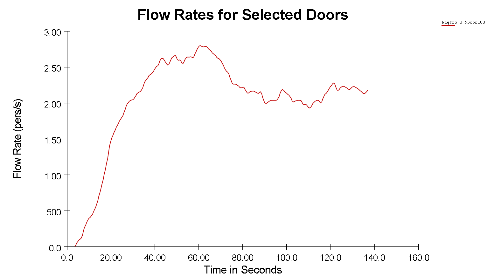

### [Plik z podsumowaniem symulacji](https://github.com/Ehevi/EvacuationModelling/blob/99dff6111bf9d4d7ba3fc3511c7d57eccdf28dd0/Resources/evacuation_summary.txt)

## Cromosim

# Etap 4.
Model posiada wpełni zaimplementowane piętra budynku D-17, które dodatkowo zostały ograniczone do samego skrzydła Turinga. W symulacji bierze udział 221 agentów, któzy kierują się do jednego z czterech zlokalizowanych na parterze wyjść ewakuacyjnych.  

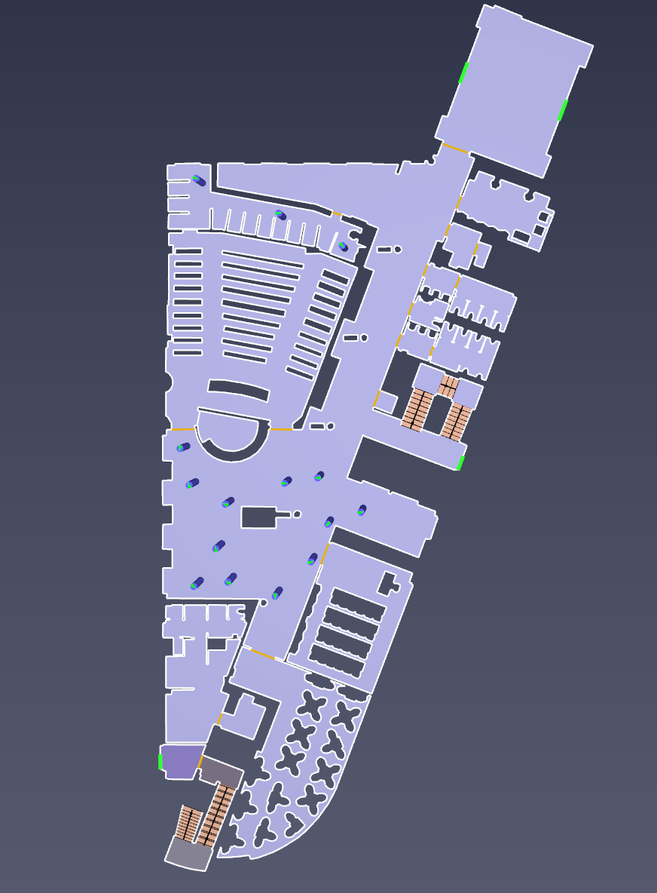
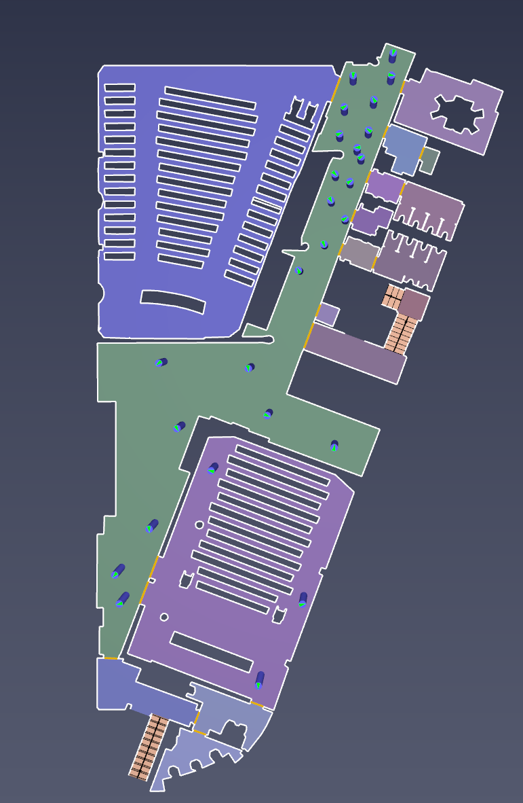
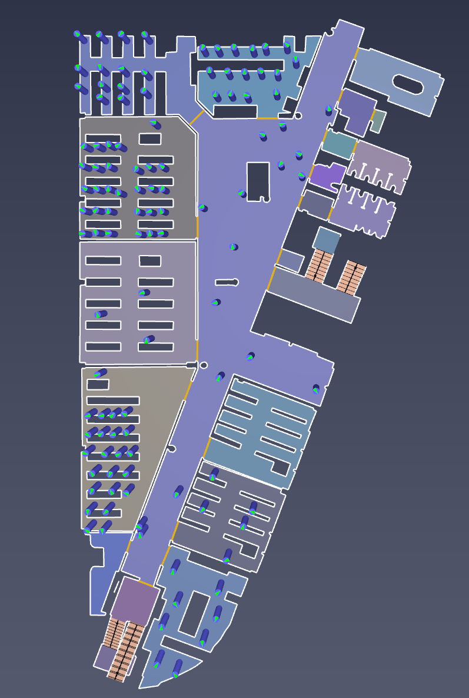
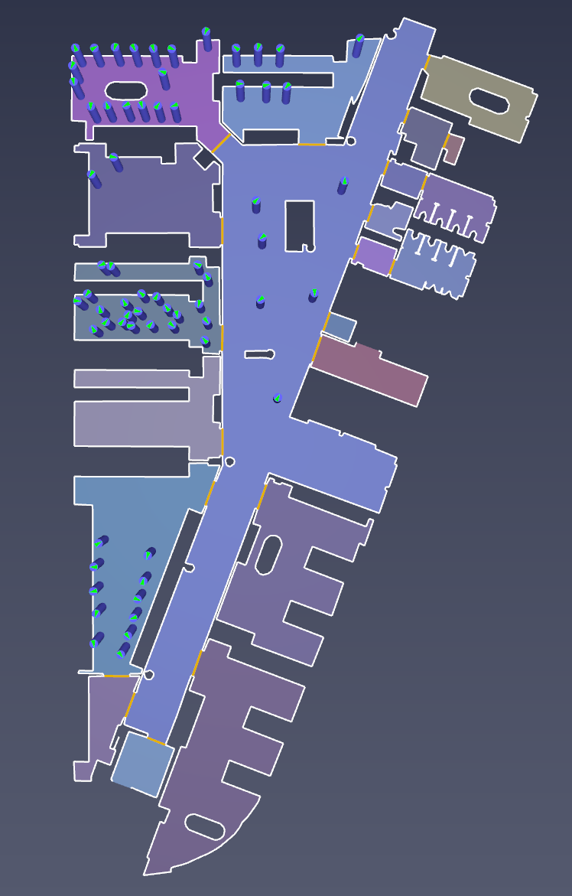
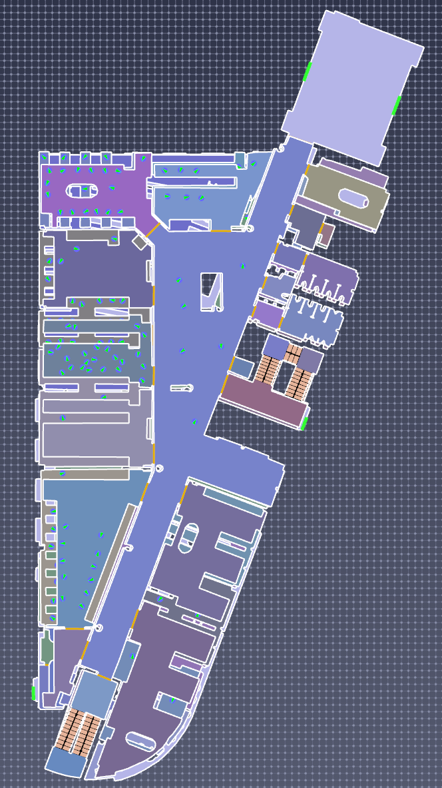
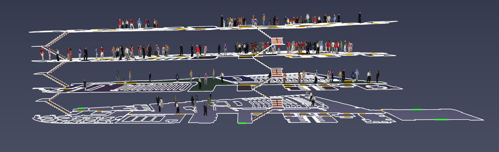
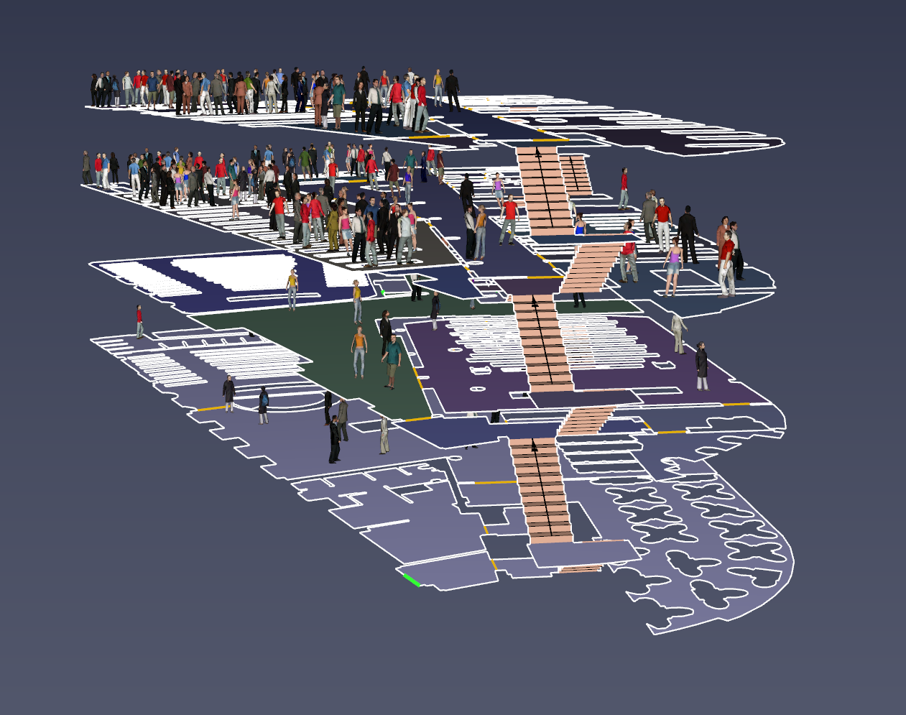
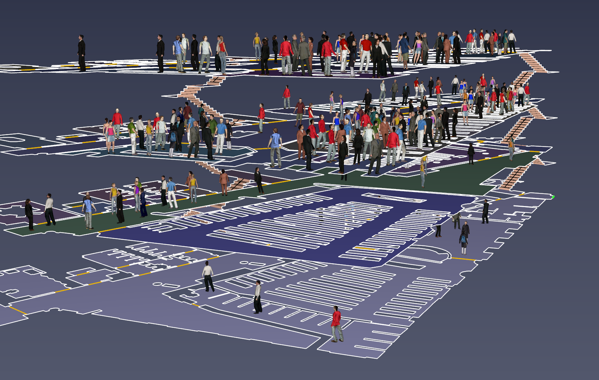
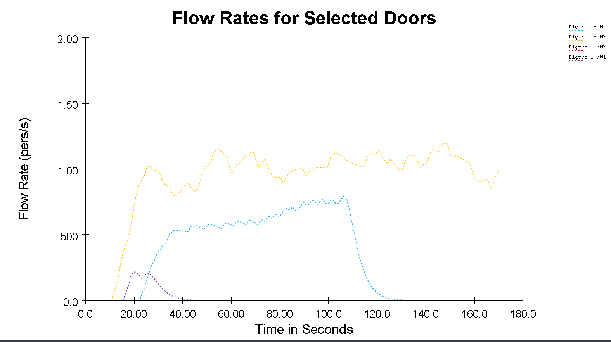
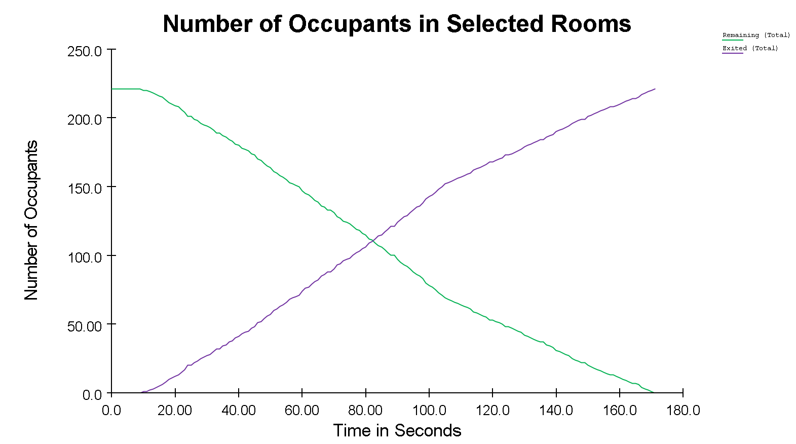

## Model wykorzystywany przez narzędzie Pathfinder
### Poruszanie się ewakuantów
1. SFPE - wdraża koncepcje zawarte w Podręczniku **SFPE Handbook of Fire Protection Engineering** (SFPE 2016). Jest to model przepływu, w którym prędkość chodzenia jest określana na podstawie gęstości osób w każdym pokoju, a przepływ przez drzwi jest kontrolowany przez szerokość drzwi.
2. Sterowanie *(Steering mode)* - oparty na idei odwrotnych zachowań sterujących *(inverse steering behavior)*. Zachowania sterujące zostały po raz pierwszy przedstawione w 1999 roku w [artykule Craiga Reinoldsa „Steering Behaviors For Autonomous Characters”](https://www.researchgate.net/publication/2495826_Steering_Behaviors_For_Autonomous_Characters), a później udoskonalone w odwrotne zachowania sterujące w artykule Heni Ben Amor (Amor i in. 2006). Takie rozwiązanie ma na celu umożliwienie improwizacji i bardziej rzeczywistego zachowania agentów. Sterowanie jest tutaj rozumiane jako definicja ścieżki, po której nastąpi poruszanie się poprzez dekompozycję głównego celu na zbiór podceli. Taki tryb sterowania pozwala na naturalne pojawienie się bardziej złożonych zachowań jako produkt uboczny algorytmów ruchu – eliminując potrzebę jawnych kolejek do drzwi i obliczeń gęstości.

### Geometria
Pathfinder używa modelu geometrii 3D. W tym modelu geometrycznym znajduje się **siatka nawigacyjna** zdefiniowana jako ciągła triangulowana powierzchnia 2D. Siatka nawigacyjna to nieregularna jednostronna powierzchnia reprezentowana przez sąsiednie trójkąty. Ruch pasażerów odbywa się w granicach tej siatki nawigacyjnej.

Pathfinder obsługuje rysowanie lub automatyczne generowanie siatki nawigacyjnej z importowanej geometrii — w tym plików Fire Dynamics Simulator (FDS), plików PyroSim i zbioru innych popularnych formatów plików CAD.

##### Widok modelu geometrii 3D

##### Widok siatki nawigacyjnej

Przeszkody są pośrednio reprezentowane jako luki w siatce nawigacyjnej. Ponieważ ewakuanci mogą przemieszczać się tylko po siatce nawigacyjnej, technika ta zapobiega wpływowi narzutu reprezentacji obiektu stałego na symulator. Gdy siatka nawigacyjna jest generowana przez importowanie geometrii, każdy obszar siatki zablokowany przez obiekt bryłowy jest automatycznie usuwany.

### Zachowania i cele ewakuantów
Każdemu aktorowi przypisuje się w interfejsie użytkownika odpowiednie zachowanie. Zachowanie dyktuje sekwencję celów, które pasażer musi osiągnąć w symulacji.

Główne typy celów w Pathfinder:
1. Cele bezczynne *(idle)* - aktor czeka w danej lokalizacji do momentu wystąpienia zdarzenia, takiego jak upłynięcie przedziału czasowego lub dotarcie windy na piętro rozładowania.
2. Cele poszukujące *(seek)* - aktor porusza się w kierunku miejsca docelowego, takiego jak punkt nawigacyjny, pokój, winda lub wyjście.
3. Cele natychmiastowe *(instantaneous)* - występują w jednym kroku czasowym.

##### Opisy zachowań ewakuantów

### Znajdowanie ścieżki
1. Planowanie
2. Generowanie ścieżki
3. Poruszanie się po ścieżce

##### Tryb SFPE

##### Tryb sterowania

### Opis pętli symulacyjnej
Pathfinder działa w pętli symulacyjnej, która oblicza ruch w dyskretnych krokach czasowych. Dla każdego kroku czasowego wykonywane są następujące kroki:

1. Zaktualizuj bieżący punkt docelowy każdego aktora. Ten krok trwa najdłużej na pierwszym etapie, ponieważ każdy aktor musi znaleźć ścieżkę do swojego celu.
2. Oblicz prędkość sterowania każdego aktora. Prędkość będzie obliczana inaczej w zależności od tego, czy aktywny jest tryb SFPE, czy sterowanie reaktywne.
3. Zwiększ bieżący krok czasu.
4. Przesuń każdego aktora.
    * Oblicz prędkość dla aktualnego czasu. Jeśli tryb sterowania jest włączony, funkcja ta obliczy żądaną siłę kierowania na podstawie żądanej prędkości, a następnie użyje całkowania do obliczenia rzeczywistej prędkości.  trybie SFPE zostanie to po prostu ustawione na żądaną prędkość.
    * Jeśli funkcja unikania kolizji jest włączona, wykryj potencjalne kolizje i zmodyfikuj żądaną prędkość, aby uniknąć kolizji.
    * Całkuj prędkość końcową, aby znaleźć maksymalną odległość przemieszczenia i przemieść agenta wzdłuż siatki, aż ta odległość zostanie osiągnięta lub do najwcześniejszej kolizji.
5. Zaktualizuj pliki wyjściowe.

# Etap 5.
Zachowania poszczególnych agentów zostały zmodyfikowane w taki sposób, aby były zgodne z rzeczywistymi danymi (z ewakuacji budynku D17 Akademii Górniczo-Hutniczej w Krakowie). Postaci z różnych pomieszczeń rozpoczynają ewakuację z ustalonym opóźnieniem. Prędkość poruszania się postaci została ustawiona na 0.91m/s (zgodnie z pracą dyplomową).

|  | Dane rzeczywiste | Symulacja |
|--------:|--------|--------------|
| czas trwania | 428s | 432s |
| liczba osób |
| wyjście W1 | 32 | 3 |
| wyjście W2 | 17 | 0 |
| wyjście W3 | 157 | 166 |
| wyjście W4 | 18 | 48 |

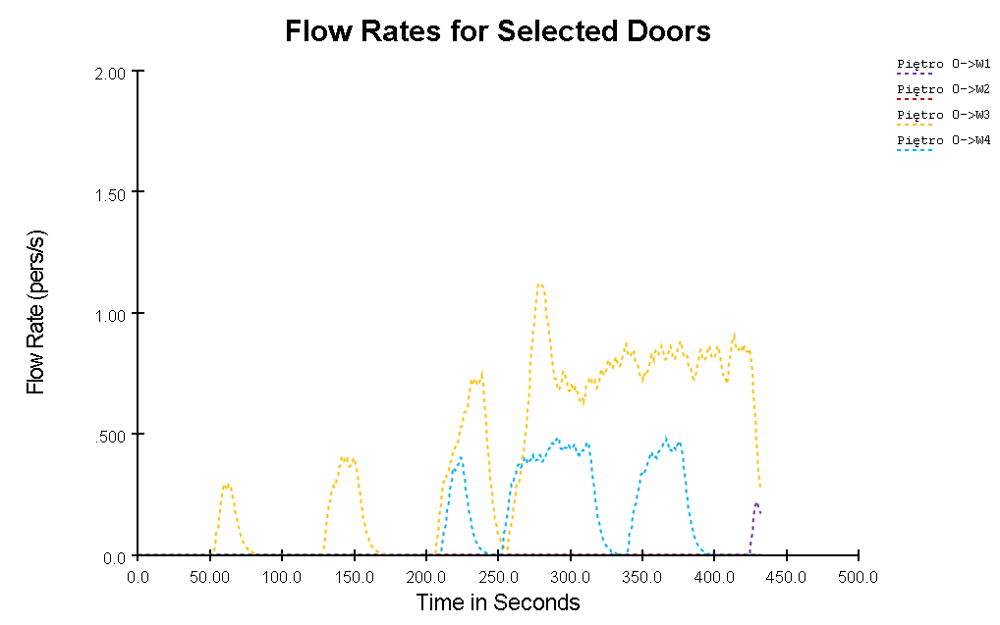
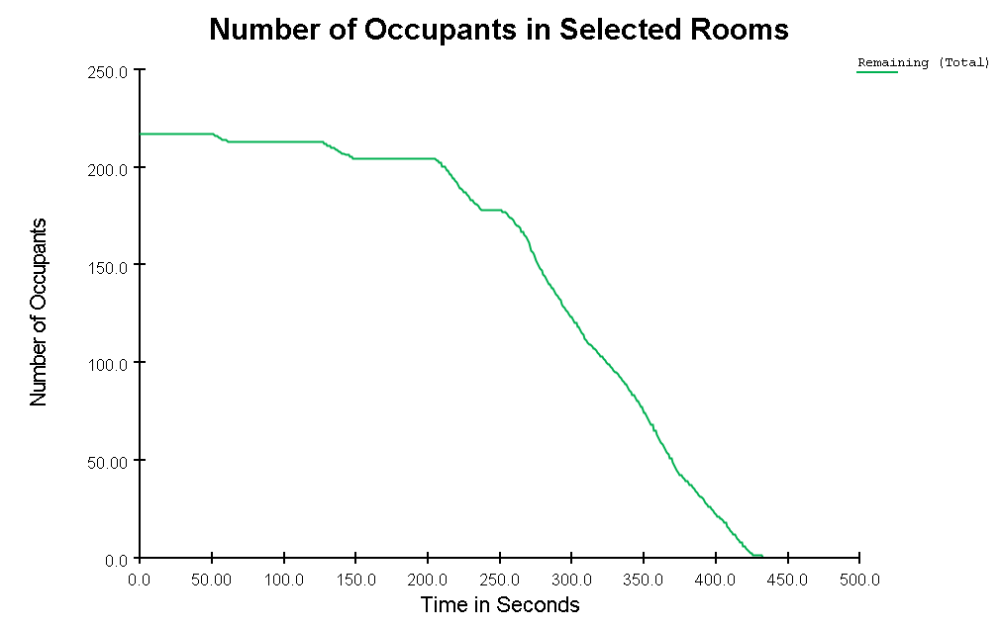
